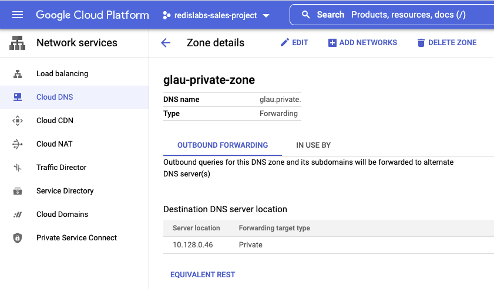
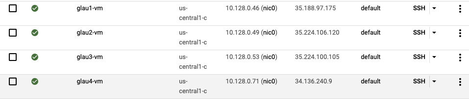

#### Create Private DNS Zone with forwarding
Note: 10.128.0.46 is the DNS server node (vm)



#### Create the following four VMs
  
glau1-vm: DNS Server  
glau2-vm: glau2.glau.private  
glau3-vm: glau3.glau.private  
glau4-vm: client (to verify DNS setting using FQDNs of glau2-vm and glau3-vm)
    

#### Create DNS Server on Ubuntu 18.04 LTS
```
sudo apt update
sudo apt upgrade

sudo apt install bind9 bind9utils bind9-doc dnsutils
```
  
```
sudo nano /etc/bind/named.conf.local
```
Enter the following content:
```
//
// Do any local configuration here
//

// Consider adding the 1918 zones here, if they are not used in your
// organization
//include "/etc/bind/zones.rfc1918";

zone    "glau.private"   {
        type master;
        file    "/etc/bind/forward.glau.private";
 };
```

```
sudo nano /etc/bind/forward.example.com
```
Enter the following content:
```
$TTL 1d
@               IN      SOA     dns1.glau.private.    hostmaster.glau.private. (
                1        ; serial
                6h       ; refresh after 6 hours
                1h       ; retry after 1 hour
                1w       ; expire after 1 week
                1d )     ; minimum TTL of 1 day
;
;
;Name Server Information 
@               IN      NS      ns1.glau.private.
ns1             IN      A       10.128.0.46
;
;
glau2-vm        IN      A       10.128.0.49
glau3-vm        IN      A       10.128.0.53
```

#### Verify DNS setup
The first checks the global configuration files and is used as follows:
```
sudo named-checkconf /etc/bind/named.conf.options
sudo named-checkconf /etc/bind/named.conf.local
```

The second tool will check the zone files and is used as follows:
```
sudo named-checkzone glau.private /etc/bind/forward.glau.private 
```

When you have finished editing these files and they do not throw any errors when you check BIND must be restarted and enabled so that it starts on boot:
```
sudo systemctl enable bind9.service
sudo systemctl restart bind9.service
```

#### Configure Systemd To Keep BIND Running
First, make a copy of the BIND systemd service file that we will edit:
```
sudo cp /lib/systemd/system/bind9.service /etc/systemd/system/
```

This will ensure that the edits will not be lost in future system updates. Next, open the file in an editor:
```
sudo nano /etc/systemd/system/bind9.service
```

And add the following two lines to the [Service] section:
```
Restart=always
RestartSec=3
```

Then prompt Systemd to reload all its service files:
```
sudo systemctl daemon-reload
```

And restart BIND:
```
sudo systemctl restart bind9.service
```
Now, if BIND stop running for any reason, systemd will restart it again automatically.
  

#### Test the DNS Server
```
dig @10.128.0.46 -t A glau2-vm.glau.private
```
It should return the following output:
```
; <<>> DiG 9.11.3-1ubuntu1.17-Ubuntu <<>> @10.128.0.46 -t A glau2-vm.glau.private
; (1 server found)
;; global options: +cmd
;; Got answer:
;; ->>HEADER<<- opcode: QUERY, status: NOERROR, id: 35403
;; flags: qr aa rd ra; QUERY: 1, ANSWER: 1, AUTHORITY: 1, ADDITIONAL: 2

;; OPT PSEUDOSECTION:
; EDNS: version: 0, flags:; udp: 4096
; COOKIE: f7fb096be8b91c4875e8b0556246a5bb70c53e4766a0e0d3 (good)
;; QUESTION SECTION:
;glau2-vm.glau.private.         IN      A

;; ANSWER SECTION:
glau2-vm.glau.private.  86400   IN      A       10.128.0.49

;; AUTHORITY SECTION:
glau.private.           86400   IN      NS      ns1.glau.private.

;; ADDITIONAL SECTION:
ns1.glau.private.       86400   IN      A       10.128.0.46

;; Query time: 0 msec
;; SERVER: 10.128.0.46#53(10.128.0.46)
;; WHEN: Fri Apr 01 07:11:55 UTC 2022
;; MSG SIZE  rcvd: 128
```

Then, run the following command:
```
dig @10.128.0.46 -t A glau3-vm.glau.private
```
It should return the following output:
```
; <<>> DiG 9.11.3-1ubuntu1.17-Ubuntu <<>> @10.128.0.46 -t A glau3-vm.glau.private
; (1 server found)
;; global options: +cmd
;; Got answer:
;; ->>HEADER<<- opcode: QUERY, status: NOERROR, id: 26593
;; flags: qr aa rd ra; QUERY: 1, ANSWER: 1, AUTHORITY: 1, ADDITIONAL: 2

;; OPT PSEUDOSECTION:
; EDNS: version: 0, flags:; udp: 4096
; COOKIE: 04a04f53982740369720fdbb6246a61c0c962e3fb2f4fa81 (good)
;; QUESTION SECTION:
;glau3-vm.glau.private.         IN      A

;; ANSWER SECTION:
glau3-vm.glau.private.  86400   IN      A       10.128.0.53

;; AUTHORITY SECTION:
glau.private.           86400   IN      NS      ns1.glau.private.

;; ADDITIONAL SECTION:
ns1.glau.private.       86400   IN      A       10.128.0.46

;; Query time: 0 msec
;; SERVER: 10.128.0.46#53(10.128.0.46)
;; WHEN: Fri Apr 01 07:13:32 UTC 2022
;; MSG SIZE  rcvd: 128
```


#### Test the FQDNs from glau4-vm
```
nslookup glau2-vm.glau.private
```
It should return:
```
Server:         127.0.0.53
Address:        127.0.0.53#53

Non-authoritative answer:
Name:   glau2-vm.glau.private
Address: 10.128.0.49
```
  
Then, run the following command:
```
nslookup glau3-vm.glau.private
```
It should return the following output:
```
Server:         127.0.0.53
Address:        127.0.0.53#53

Non-authoritative answer:
Name:   glau3-vm.glau.private
Address: 10.128.0.53
```


#### Troubleshooting
1. If nslookup does not return the correct IP address, run this command: **sudo systemd-resolve --flush-caches**

